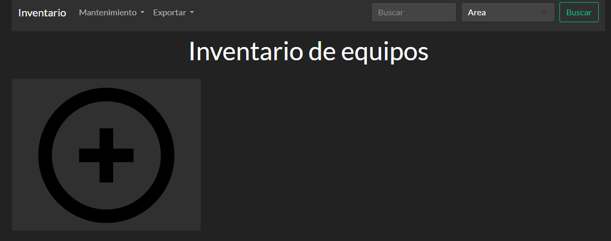

# Control mantenimineto de equipos y dispositivos
Es un control del inventario y el mantenimineto de equipos y dispositivos,
usando las tecnologias de javascript, para frontend, backend y base de datos



# Instalacion como servicio
Se puede instalar como un servicio para su uso en una red local

```bash
$ npm run service
```

# Tecnologias usadas
- Nodejs
    - Express
    - Express-Handlebars
    - Mysql
    - Mysqldump
    - Excel4node
    - Node-windows
- Mysql

# Links y recursos usasdos en este projecto
- [Bootswatch](https://bootswatch.com/)
- [Fontawesome](https://fontawesome.com/)
- [Datatables](https://datatables.net/)
